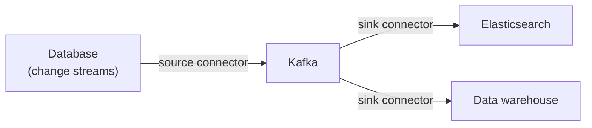

# Appendix A — The Kafka Ecosystem: Connect, Streams, ksqlDB, Schema Registry

Core Kafka is a log with two APIs. The ecosystem around it turns Kafka into a *platform* — this appendix is a map of the four tools you will meet first.

---

## 1. Kafka Connect — integration without code

**What it is:** a framework that runs **connectors** — prebuilt, config-driven pipelines between Kafka and the outside world.

- **Source connectors** pull *into* Kafka (databases, APIs, file systems)
- **Sink connectors** push *from* Kafka (databases, search indexes, data warehouses)



**Vocabulary:**

| Term | Meaning |
|---|---|
| **Connector** | The config describing *what* to copy and where |
| **Task** | A unit of connector parallelism (often one per partition) |
| **Worker** | The JVM process running connectors/tasks (yours or a service's) |
| **Converter** | Serialization boundary between connector data and Kafka records (JSON, Avro...) |
| **Standalone vs distributed** | One process + properties files vs a cluster of workers coordinating via three internal topics (`connect-configs`, `connect-offsets`, `connect-status`) with a REST API |

**The flagship pattern — CDC (change data capture):** a source connector tails a database's change log (e.g., MongoDB change streams, Postgres logical decoding/Debezium) and publishes every committed change as an event. This kills the **dual-write problem** — your service writes only to its database; the connector publishes *from the committed log*, atomically consistent by construction. Source offsets (e.g., Mongo resume tokens) play exactly the role consumer offsets do: restart-safe position tracking.

**Error handling (config-only, the payoff of [Part 2 ch. 10](../part-2-kafka-deep-dive/10-errors-and-retries.md)):**

```properties
errors.tolerance=all
errors.deadletterqueue.topic.name=my-topic-dlq
errors.deadletterqueue.topic.replication.factor=3
```

## 2. Kafka Streams — stream processing as a library

**What it is:** a Java library (no separate cluster) for stateful processing of Kafka topics: filter/map/aggregate/join windows of events.

- Runs inside *your* application; scales like your service (instances form a group over input partitions)
- **KStream** = an unbounded event stream; **KTable** = a changelog viewed as a materialized key→value state (backed by a compacted topic — [Part 2 ch. 12](../part-2-kafka-deep-dive/12-retention.md))
- Supports exactly-once processing via Kafka transactions

Mental model: *map/reduce, but continuous, with windows and tables, where the filesystem is Kafka itself.*

## 3. ksqlDB — SQL over streams

**What it is:** Kafka Streams exposed as SQL.

```sql
CREATE TABLE click_counts AS
  SELECT ad_id, COUNT(*) AS clicks
  FROM clicks WINDOW TUMBLING (SIZE 1 MINUTE)
  GROUP BY ad_id EMIT CHANGES;
```

Pull queries read current table state; push queries stream results live. Great for analytics-ish processing without Java; less flexible than Streams for custom logic.

## 4. Schema Registry — contracts for your events

**The problem:** Kafka stores bytes; a producer's idea of `Order` and a consumer's idea can silently diverge.

**The solution:** a registry service stores schemas (Avro/Protobuf/JSON) by ID; producers register schemas and write *references* into record headers; consumers fetch by ID.

- Wire format becomes compact binary + stable contract
- **Compatibility modes** police evolution — e.g., `BACKWARD` rejects a new schema that would break old consumers (removing a field they read, changing a type)
- Pairs naturally with Connect converters and ksqlDB

| Mode | Rule |
|---|---|
| `BACKWARD` | New schema can read data written with the previous schema |
| `FORWARD` | Old consumers can read data written with the new schema |
| `FULL` | Both directions |
| `NONE` | No checks — you will regret it |

## Which tools when?

- "Get data in/out of Kafka" → **Connect** (don't write that code)
- "Transform/aggregate streams in a service" → **Streams** (or ksqlDB for SQL-shaped problems)
- "Many teams sharing event formats" → **Schema Registry**, day one

**Next:** [Appendix B — Operations](B-operations.md)
