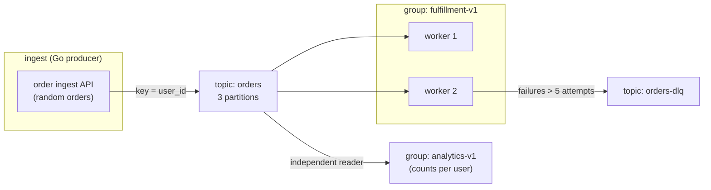

# Appendix C — Hands-On Project: An Order-Processing Pipeline

> Level: Intermediate · A guided end-to-end build using everything in this guide: one broker, one topic, two consumer groups, ordering by key, retries, DLQ, and lag observation. Runs 100% locally with Docker and Go.

## What you will build



Two groups over one topic demonstrate the two consumption models at once: fulfillment (work queue — each order processed once) and analytics (pub/sub — full stream, aggregated).

## Step 0 — Prerequisites

- Docker + Docker Compose
- Go 1.21+

## Step 1 — Broker

Use the compose file from [Part 3 ch. 01](../part-3-go-and-configs/01-setup-and-broker.md) (or `hands-on/docker-compose.yml` in this repo):

```bash
docker compose up -d
docker compose ps   # wait for kafka (healthy)
```

## Step 2 — Topic

Explicit, 3 partitions:

```bash
docker exec -it kafka kafka-topics --bootstrap-server localhost:9092 \
  --create --topic orders --partitions 3 --replication-factor 1
```

## Step 3 — The shared event type

```go
// event.go
package main

type OrderEvent struct {
	OrderID string  `json:"order_id"`
	UserID  string  `json:"user_id"`
	Amount  float64 `json:"amount"`
}
```

## Step 4 — The producer (ingest)

A loop producing orders with `user_id` keys — same user always lands on the same partition, so per-user order history stays ordered ([Part 2 ch. 03](../part-2-kafka-deep-dive/03-message-lifecycle.md)).

```go
// producer/main.go
package main

import (
	"encoding/json"
	"fmt"
	"log"
	"math/rand"
	"time"

	"github.com/IBM/sarama"
)

func main() {
	config := sarama.NewConfig()
	config.Version = sarama.V3_5_0_0
	config.Producer.Return.Successes = true
	config.Producer.RequiredAcks = sarama.WaitForAll
	config.Producer.Idempotent = true
	config.Net.MaxOpenRequests = 1

	producer, err := sarama.NewSyncProducer([]string{"localhost:9092"}, config)
	if err != nil {
		log.Fatal(err)
	}
	defer producer.Close()

	for i := 0; ; i++ {
		ev := OrderEvent{
			OrderID: fmt.Sprintf("order-%d", i),
			UserID:  fmt.Sprintf("user-%d", rand.Intn(50)), // 50 users = 50 keys
			Amount:  float64(rand.Intn(100)) + 0.99,
		}
		payload, _ := json.Marshal(ev)

		p, o, err := producer.SendMessage(&sarama.ProducerMessage{
			Topic: "orders",
			Key:   sarama.StringEncoder(ev.UserID), // ordering scope = user
			Value: sarama.ByteEncoder(payload),
		})
		if err != nil {
			log.Printf("publish failed: %v", err)
		} else {
			fmt.Printf("published %s partition=%d offset=%d\n", ev.OrderID, p, o)
		}
		time.Sleep(200 * time.Millisecond)
	}
}
```

## Step 5 — The fulfillment consumer (work queue + retries + DLQ)

Implements the full [Part 2 ch. 10](../part-2-kafka-deep-dive/10-errors-and-retries.md) pattern: process → mark; transient failures → bounded inline retries → retry topic → DLQ.

```go
// consumer/main.go
package main

import (
	"context"
	"encoding/json"
	"fmt"
	"log"
	"math/rand"
	"os/signal"
	"strconv"
	"syscall"

	"github.com/IBM/sarama"
)

type handler struct {
	producer sarama.SyncProducer
}

func (h *handler) Setup(sarama.ConsumerGroupSession) error   { return nil }
func (h *handler) Cleanup(sarama.ConsumerGroupSession) error { return nil }

func (h *handler) ConsumeClaim(sess sarama.ConsumerGroupSession, claim sarama.ConsumerGroupClaim) error {
	for msg := range claim.Messages() {
		attempt := attemptFrom(msg)

		var ev OrderEvent
		if err := json.Unmarshal(msg.Value, &ev); err != nil {
			log.Printf("poison payload (deterministic) -> DLQ: %s", msg.Value)
			publish(h.producer, "orders-dlq", msg.Key, msg.Value, 999)
			sess.MarkMessage(msg, "")
			continue
		}

		if err := process(ev); err != nil { // transient failure
			if attempt < 5 {
				log.Printf("%s failed (attempt %d), -> retry topic", ev.OrderID, attempt)
				publish(h.producer, "orders-retry", msg.Key, msg.Value, attempt+1)
			} else {
				log.Printf("%s exhausted retries -> DLQ", ev.OrderID)
				publish(h.producer, "orders-dlq", msg.Key, msg.Value, attempt)
			}
		}
		sess.MarkMessage(msg, "") // work settled (processed OR parked) — ch. 09/10 discipline
	}
	return nil
}

// process simulates work: 20% transient failure rate
func process(ev OrderEvent) error {
	if rand.Intn(100) < 20 {
		return fmt.Errorf("payment provider timeout")
	}
	fmt.Printf("fulfilled %s (%.2f)\n", ev.OrderID, ev.Amount)
	return nil
}

func attemptFrom(msg *sarama.ConsumerMessage) int {
	for _, h := range msg.Headers {
		if string(h.Key) == "attempt" {
			n, _ := strconv.Atoi(string(h.Value))
			return n
		}
	}
	return 1
}

func publish(p sarama.SyncProducer, topic string, key, value []byte, attempt int) {
	m := &sarama.ProducerMessage{Topic: topic, Key: sarama.ByteEncoder(key), Value: sarama.ByteEncoder(value)}
	m.Headers = append(m.Headers, sarama.RecordHeader{Key: []byte("attempt"), Value: []byte(strconv.Itoa(attempt))})
	if _, _, err := p.SendMessage(m); err != nil {
		log.Printf("parking publish failed: %v", err)
	}
}

func main() {
	brokers := []string{"localhost:9092"}

	pc := sarama.NewConfig()
	pc.Version = sarama.V3_5_0_0
	pc.Producer.Return.Successes = true
	pc.Producer.RequiredAcks = sarama.WaitForAll
	producer, err := sarama.NewSyncProducer(brokers, pc)
	if err != nil {
		log.Fatal(err)
	}
	defer producer.Close()

	cc := sarama.NewConfig()
	cc.Version = sarama.V3_5_0_0
	cc.Consumer.Offsets.Initial = sarama.OffsetOldest
	group, err := sarama.NewConsumerGroup(brokers, "fulfillment-v1", cc)
	if err != nil {
		log.Fatal(err)
	}
	defer group.Close()

	ctx, stop := signal.NotifyContext(context.Background(), syscall.SIGINT, syscall.SIGTERM)
	defer stop()

	h := &handler{producer: producer}
	// one session per Consume call — listens to BOTH topics (retry comes back through the same group)
	for {
		if err := group.Consume(ctx, []string{"orders", "orders-retry"}, h); err != nil {
			log.Printf("session error: %v", err)
		}
		if ctx.Err() != nil {
			return
		}
	}
}
```

Create the helper topics before running:

```bash
for t in orders-retry orders-dlq; do
  docker exec -it kafka kafka-topics --bootstrap-server localhost:9092 \
    --create --topic $t --partitions 3 --replication-factor 1
done
```

## Step 6 — The analytics consumer (pub/sub)

Same skeleton, `group: analytics-v1`, subscribing only to `orders`, keeping an in-memory `map[string]int` of orders per user — proof that two groups independently read the same stream. (Reuse Step 5's structure; swap the handler body.)

## Step 7 — Run it and *observe*

```bash
go run ./producer
go run ./consumer
go run ./analytics
```

**Experiments that turn theory into memory:**

1. **Key stickiness:** in producer logs, one `user_id` → always the same partition, offsets strictly increasing ([ch. 03](../part-2-kafka-deep-dive/03-message-lifecycle.md))
2. **Downtime & lag:** stop the fulfillment consumer for a minute, watch lag climb, restart, watch it drain to 0 ([Part 3 ch. 05](../part-3-go-and-configs/05-admin-and-observability.md)):

   ```bash
   kafka-consumer-groups --bootstrap-server localhost:9092 --describe --group fulfillment-v1
   ```
3. **Work queue vs pub/sub:** kill the analytics consumer — fulfillment is untouched; both groups' offsets tracked independently
4. **Retries & DLQ:** watch the 20% simulated failures flow orders → orders-retry → (mostly) fulfilled, a tail → orders-dlq; inspect the DLQ:

   ```bash
   kafka-console-consumer --bootstrap-server localhost:9092 --topic orders-dlq --from-beginning
   ```
5. **Scale a group:** run a second fulfillment instance — partitions split 2+1; a fourth instance idles (ceiling = 3 partitions, [ch. 02](../part-2-kafka-deep-dive/02-core-concepts.md))

**Next:** [Appendix D — interview questions](D-interview-questions.md)
