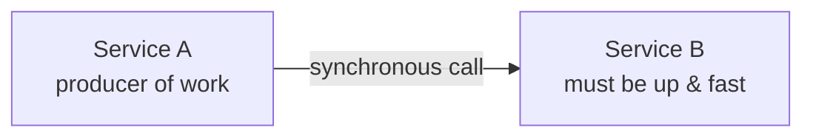
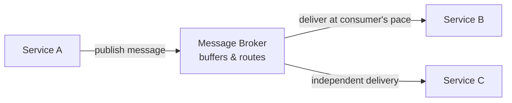
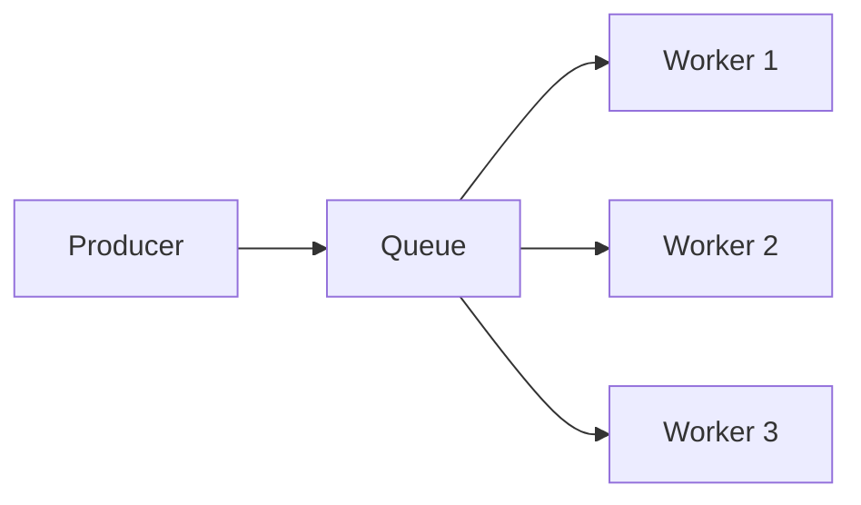
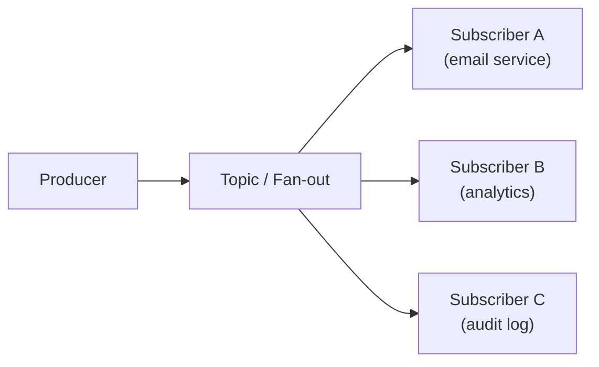
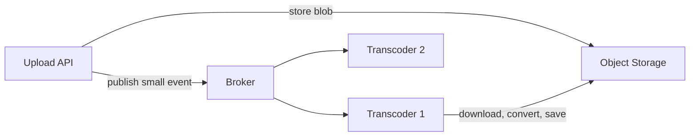

# 01 — Message Brokers & The Systems That Need Them

> Level: Beginner

Before comparing RabbitMQ and Kafka, you need to understand the **problem** both of them solve. A message broker is not a database, not an API gateway, and not a cache — it is a system whose entire job is to **accept messages from producers, hold them reliably, and deliver them to consumers** — decoupling the two sides in time, scale, and availability.

---

## 1. The problem: direct communication

The default way two services talk is a synchronous request: service A calls service B and waits for a response.

This simple design has four failure modes that show up again and again in real systems:

| Failure mode | What happens |
|---|---|
| **Availability coupling** | If B is down, A fails too — even though A's core job succeeded |
| **Latency coupling** | A's response time = A's work + B's work. One slow dependency slows everything |
| **Burst overload** | A traffic spike hits B at full force. B has no buffer |
| **Scale lockstep** | A and B must be scaled together, even if their load profiles differ |

A message broker inserts an intermediary:

Now A publishes a message and moves on. The broker guarantees delivery to B (and C) — now, or when they recover, at whatever pace they can handle. A no longer knows or cares who consumes its events.

---

## 2. The two core patterns

Almost every broker use case is a combination of two patterns.

### 2.1 Point-to-point (queue / work queue)

Each message is consumed by **exactly one** consumer. Used to distribute work across a pool of workers.

- Message lifetime: removed after successful processing (destructive consumption)
- Consumers compete; adding workers increases throughput
- Examples: sending emails, resizing images, running background jobs

### 2.2 Publish/subscribe (pub/sub)

Each message is delivered to **every subscriber**. Producers and consumers don't know each other.

- One event, many independent views of it
- Each subscriber keeps its own position/acknowledgments
- Examples: "user signed up" → send email, update CRM, enrich profile

> **Kafka in one sentence:** a single system where *topics* give you pub/sub, and *consumer groups* over those topics give you point-to-point work distribution — over a durable, replayable log.

---

## 3. System designs that need a broker

Recognizing these shapes is the real skill. If a design contains any of the following, it probably wants a broker.

### 3.1 Work that can happen asynchronously

The user's request must not wait for the slow part.

**Example — video upload:** storing the video is the request; *transcoding* into 480p/720p/1080p takes minutes. Publish `video-uploaded` (a small message with a storage URL), and transcoding workers consume it later. The user gets an instant response; the heavy work happens in the background.

### 3.2 Absorbing bursts (buffering / traffic shaping)

Traffic arrives faster than it can be processed, temporarily.

**Example — flash sale or ticket sales:** instead of letting 500k users contend for the same seats, admit users in controlled batches: enqueue everyone, release 100 at a time. The queue converts an unmanageable spike into a steady, processable stream.

### 3.3 Decoupling so sides scale independently

**Example — code-judging platform:** 100k submissions land at once. The frontend/API tier scales wide, dumps submissions into a queue, and stays fast. The expensive container pool that actually runs code can stay small and chew through the queue at its own pace — no lockstep scaling, lower cost.

### 3.4 Event-driven microservices

Services communicate through events ("order placed", "payment completed") instead of calling each other. Adding a new consumer (e.g., fraud detection) requires zero changes to the producer.

### 3.5 Ordered event streams

When events about the same entity must be processed in order (balance updates, status transitions, inventory changes), brokers with per-entity ordering guarantees (partitioning by key) protect correctness under concurrency.

### 3.6 Data pipelines & real-time analytics

Feeding clickstreams, logs, metrics, and database changes into analytics/processing engines. Producers write continuously; processors (e.g., Flink) consume as a stream and aggregate in real time.

---

## 4. Two families of brokers

Brokers split into two architectural families — and this distinction is the entire RabbitMQ-vs-Kafka story:

| | **Queue-based brokers** (RabbitMQ, SQS, ActiveMQ) | **Log-based stream platforms** (Kafka) |
|---|---|---|
| Core structure | Named queues; message routed to a queue | Append-only log per partition |
| After consumption | Message **removed** (destructive) | Message **stays** for a retention period |
| Replay old messages | No — once acked, gone | Yes — consumers rewind by offset |
| Consumers | Usually pushed messages | Pull messages at their own pace |
| Ordering | Per queue | Per partition (within a topic) |
| Best at | Complex routing, task queues, per-message control | High-throughput event streaming, replay, many independent consumers |

Keep this table in mind — the next chapter turns it into a full comparison of the two most famous representatives.

---

## Key takeaways

1. Brokers buy you **decoupling in time, scale, and availability** — at the cost of eventual processing and operational complexity.
2. Two patterns cover everything: **point-to-point** (work distribution) and **pub/sub** (fan-out).
3. Learn to spot the shapes: async work, burst absorption, independent scaling, event-driven services, ordered streams, data pipelines.
4. The first fork in the road: **destructive queue** vs **retained log**. Choose based on whether you ever want to *re-read* or *have many independent readers* of the same events.

**Next:** [02 — RabbitMQ vs Kafka](02-rabbitmq-vs-kafka.md)
