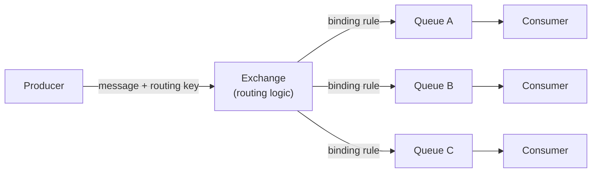
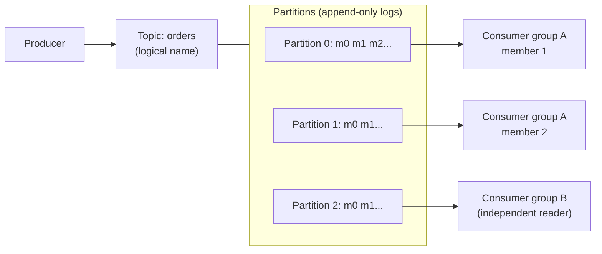

# 02 — RabbitMQ vs Kafka

> Level: Beginner

RabbitMQ and Kafka both answer "we need a message broker", but they come from opposite philosophies:

- **RabbitMQ** (2007): a *smart broker* — it understands routing, pushes messages to consumers, and deletes them once processed.
- **Kafka** (2011, LinkedIn): a *dumb, fast broker* — an append-only distributed log that consumers pull from and can re-read as long as data is retained.

---

## 1. RabbitMQ in five minutes

RabbitMQ implements the **AMQP 0-9-1** protocol. Its mental model: producers never write to queues directly — they write to **exchanges**, and routing rules (**bindings**) decide which queue(s) receive each message.

**Core concepts:**

| Concept | What it is |
|---|---|
| **Exchange** | Where producers publish. Types decide routing behavior |
| **Queue** | Buffer that holds messages until a consumer acknowledges them |
| **Binding** | Rule connecting an exchange to a queue (often a routing-key pattern) |
| **Routing key** | A label on the message the bindings match against |
| **Ack** | Consumer confirmation; the message is deleted after ack (or redelivered on failure) |

**Exchange types:**

| Type | Routes by |
|---|---|
| `direct` | Exact routing-key match |
| `fanout` | Broadcast to every bound queue |
| `topic` | Wildcard patterns (`order.*`, `#.error`) |
| `headers` | Message header attributes |

**How consumption works:**

- **Push model**: the broker delivers messages to consumers, throttled by **prefetch** (max unacked messages per consumer)
- Consumption is **destructive**: once acknowledged, the message is gone
- Rich per-message features: TTL, priority queues, dead-letter exchanges (DLX), delayed re-delivery
- Clustering for availability; quorum queues (Raft-based) for durable, replicated queues

**RabbitMQ shines at:** complex routing, classic task/job queues, small-to-medium message volumes, request/reply patterns, and teams that want per-message control with low operational weight.

---

## 2. Kafka in five minutes

Kafka is an **event streaming platform** — it can act as a message queue, as a publish/subscribe system, or as a real-time stream processor's backbone. But structurally it is one thing: a **distributed, replicated, append-only log**.

**Core concepts (deep dive in Part 2):**

| Concept | What it is |
|---|---|
| **Broker** | One Kafka server; a cluster is many brokers |
| **Topic** | Named stream of events (logical grouping) |
| **Partition** | The physical append-only log; the unit of parallelism and ordering |
| **Offset** | A message's sequential position in a partition |
| **Producer** | Writes messages to a topic (partition chosen by key hash or round-robin) |
| **Consumer / Consumer group** | Pulls messages; within a group each partition is read by exactly one member, so the group scales like a work queue — while *different groups* each get the full stream (pub/sub) |

**How consumption works:**

- **Pull model**: consumers ask for batches of messages and track their own **offset**
- Consumption is **non-destructive**: data stays for the retention window, so a consumer can rewind and replay, and many independent groups can read the same events
- Ordering is guaranteed **within a partition** (all events with the same key go to the same partition)
- Built for enormous throughput: sequential disk I/O, zero-copy sends, batching, and partition-level parallelism let a modest cluster handle millions of messages per second

---

## 3. The differences that matter

| Dimension | RabbitMQ | Kafka |
|---|---|---|
| **Model** | Smart broker, destructive queues | Dumb broker, retained log |
| **Message fate after consume** | Deleted on ack | Stays until retention expires |
| **Replay** | Not possible | Rewind to any offset |
| **Consumers** | Pushed to (prefetch-limited) | Pull at their own pace |
| **Ordering** | Per queue | Per partition |
| **Routing** | Exchanges/bindings — very flexible | Key-based partitioning only (by design) |
| **Throughput** | Tens of thousands msg/s typical | Millions msg/s per cluster |
| **Fan-out** | Multiple queues via bindings | Multiple consumer groups on one topic |
| **Backpressure** | Broker pushes; pref/qos control | Consumers pull — natural backpressure |
| **Per-message features** | TTL, priority, delays, DLX | Fewer — retention, compaction, batch tools |
| **Ecosystem** | Broader protocol support (AMQP, MQTT, STOMP) | Connect, Streams, SQL, schema tooling |
| **Ops profile** | Lower throughput scale; routing complexity | Cluster + storage management; retention planning |

### The litmus test

Ask one question: **do consumers ever need to re-read, or do multiple teams read the same stream independently at different times?**

- **Yes** → Kafka. A retained, replayable log is a different *kind* of asset, not just a faster queue.
- **No** — you need a task queue or complex routing (route by pattern, delay, TTL, per-message priority) → RabbitMQ (or SQS in AWS).

Both appear in the same company routinely: RabbitMQ for commands/jobs, Kafka for events/streams.

> **A note on SQS:** AWS SQS is a queue-based broker like RabbitMQ's simplest form — distributed, at-least-once, with built-in consumer retries and dead-letter queues, but no routing, no replay, and no ordering (except FIFO queues, at reduced throughput). A common cloud pattern: SQS for job queues, Kinesis/MSK (Kafka) for streams.

---

## Key takeaways

1. RabbitMQ = **routing-centric message broker**: exchanges route, consumers ack, messages vanish.
2. Kafka = **log-centric streaming platform**: append, retain, pull, replay.
3. Same-group consumers compete (work queue); cross-group consumers broadcast (pub/sub) — Kafka does both with one primitive.
4. Choose by data access pattern, not speed: need history/replay/multi-reader → Kafka; need routing/task semantics → RabbitMQ.

**Next:** [Part 2 — from a single overloaded queue to the full Kafka architecture](../part-2-kafka-deep-dive/01-from-queue-to-kafka.md)
