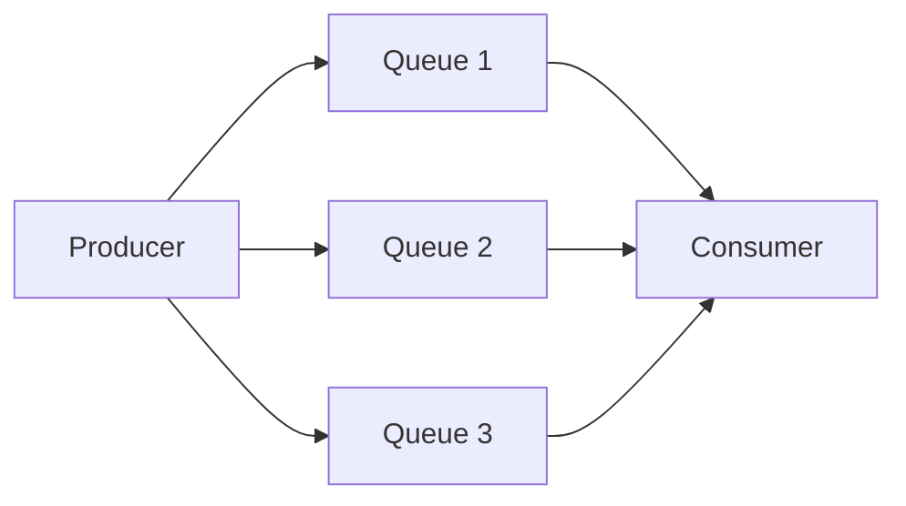
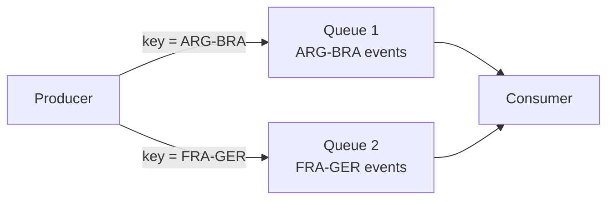
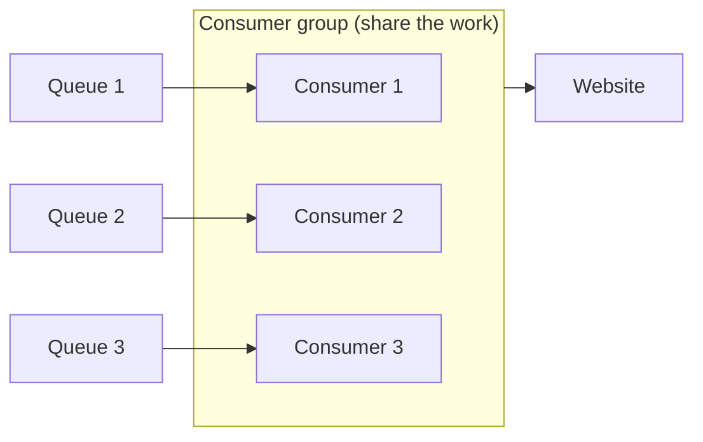
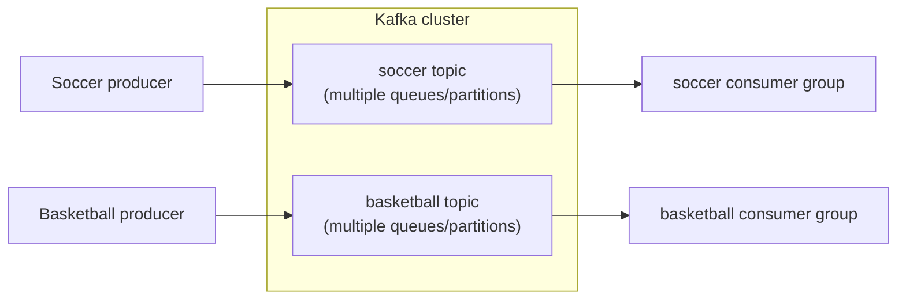

# 01 — From One Queue to Kafka: The Motivating Example

> Level: Beginner

The fastest way to understand Kafka is not to read a list of its features — it is to *re-derive* its design from a system that starts simple and hits real problems. This chapter does exactly that. Every Kafka concept in Part 2 maps back to a problem in this story.

---

## The setup

You run a website providing **real-time updates for a sports tournament** (think World Cup scale). Every time a goal is scored, a player is booked, or a substitution is made, an event must update the website.

- The process that **places events** on the queue = the **producer**
- The process that **reads events** off the queue and updates the site = the **consumer**

Through the group stage everything works: events arrive, are processed in order, users are happy.

---

## Problem 1: Too many events → scale horizontally

The organizers expand the tournament massively — far more teams — and **all games start at the same time**. The single queue server runs out of space; one machine cannot hold the load.

**Solution:** add more servers (horizontal scaling).

Three servers, or six, or more — capacity scales as far as you like. But this creates the next problem.

## Problem 2: Random distribution destroys ordering

If events are **randomly distributed** across queues, a consumer reading from all of them loses the ordering:

- The 83rd-minute substitution is processed *before* the 80th-minute goal
- The website shows goals scored before the match "started"

Events are now processed **out of order** — a correctness bug, not a performance bug.

**Solution:** distribute events **by the game they belong to**. All events of the Argentina–Brazil match go to one queue; all France events go to another.

Every event for a given game lands on the same queue → processed in order. You lose *global* ordering (France's 81st minute may be processed before Argentina's 80th), but that was never needed — what matters is **per-game ordering**.

> **This is the fundamental idea behind Kafka:** scaling requires a **user-specified distribution strategy** — the producer decides *how* messages spread across partitions, and ordering is preserved within each partition.

## Problem 3: Consumer can't keep up → consumer groups

More tournaments, more events. Now the *consumer* is the bottleneck — it is drinking from a fire hose.

**Obvious fix:** add more consumers. **New bug:** consumer 1 and consumer 2 may both read and process the *same* goal → the website reports Argentina scored twice.

**Solution:** put the consumers into a **consumer group** — Kafka's guarantee that within a group, **each event is processed by exactly one consumer**.

## Problem 4: New product lines → topics

The organizers add more sports. Your soccer website must **not** show basketball events, and the basketball site must not show soccer events.

**Solution:** **topics**. Each event is tagged with a topic, producers specify which topic they write to, and consumers subscribe to the topic they care about.

---

## What you just built

That linear chain of problems and fixes *is* Kafka's architecture:

| Problem | Fix | Kafka concept |
|---|---|---|
| Server overloaded | Add servers | **Brokers / cluster** |
| Ordering broken | Distribute by game | **Partition key** → **partitions** |
| Duplicate processing | Group consumers with exclusivity | **Consumer groups** |
| Mixed event types | Tag and subscribe | **Topics** |

From here on, we drop the sports example and use Kafka's real terminology — starting with [02 — Core Concepts](02-core-concepts.md).
