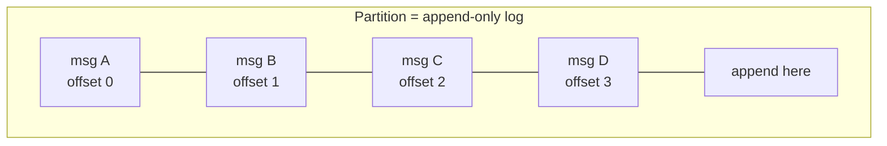
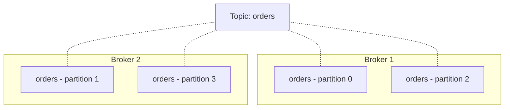
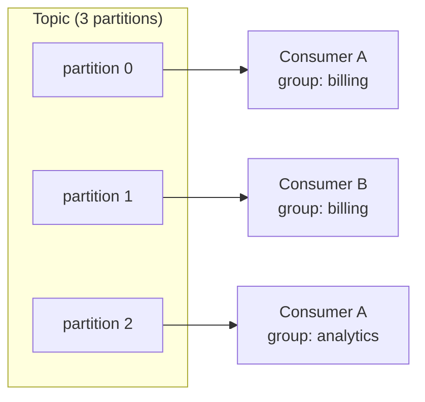

# 02 — Core Concepts: Brokers, Topics, Partitions, Producers, Consumers

> Level: Beginner

This chapter maps the motivating example onto Kafka's real vocabulary. Five terms cover 90% of everyday Kafka.

---

## 1. Broker — a server

A **broker** is simply one Kafka server (physical or virtual). A **Kafka cluster** is a set of brokers working together.

- Brokers **hold the queues** — i.e., they store the partitions on disk
- One broker can host many partitions (of many topics)
- Brokers are peers; each also takes on special roles internally (controller, partition leaders — see chapters 04–05)

## 2. Partition — the physical log

A **partition** is an **ordered, immutable, append-only sequence of messages** stored on a broker's disk. Think of a log file: you can only append to the end, never edit or insert in the middle.

- Each message gets a sequential **offset** (0, 1, 2, ...) within its partition
- Ordering is guaranteed *inside a partition only* — there is no ordering across partitions
- Partitions are the **unit of parallelism**: more partitions = more parallel producers, consumers, and disk I/O

## 3. Topic — the logical grouping

A **topic** is a named, **logical grouping of partitions** — a category of events (`orders`, `page-views`, `payments`).

- Producers **publish to a topic**; consumers **subscribe to a topic**
- A topic typically spreads its partitions across multiple brokers

### Topic vs partition — the classic confusion

| | Topic | Partition |
|---|---|---|
| Nature | **Logical** — a name, exists in metadata/code | **Physical** — an actual log file on a broker's disk |
| Purpose | **Organizing** your data | **Scaling** your data |
| Count | You choose per use case | You choose per topic (can grow later, with caveats) |

One topic → many partitions. The topic is *what*; partitions are *how it scales*.

## 4. Producer — writes records

The **producer** publishes (writes) messages/records **to a topic**. It decides which partition each message goes to — using the message **key** (or round-robin if no key). Details and code in [chapter 03](03-message-lifecycle.md) and [Part 3](../part-3-go-and-configs/02-producer.md).

## 5. Consumer & consumer group — reads records

The **consumer** reads messages **from a topic** it subscribed to.

- A consumer tracks its **position** in each partition as an **offset**
- **Consumer group**: a set of consumers sharing a group ID. Kafka assigns each partition of the topic to exactly one member of the group:
  - within a group → each message processed **once** (work distribution)
  - across groups → each group independently reads **everything** (pub/sub)

Reading is **pull-based**: consumers ask for the next batch of messages whenever they are ready — which is also how they naturally apply backpressure instead of being overwhelmed.

> Two scaling ceilings worth memorizing now:
> 1. A consumer group is capped at **one active consumer per partition** — extra members sit idle.
> 2. Adding partitions to an existing topic changes key→partition mapping (rehashing), so choose partition counts deliberately (see [08 — Scalability](08-scalability.md)).

---

## Glossary so far

| Term | Definition |
|---|---|
| Broker | One Kafka server; holds partitions |
| Cluster | Set of brokers |
| Partition | Ordered, immutable, append-only log on disk |
| Offset | Sequential position of a message within a partition |
| Topic | Logical grouping of partitions; the pub/sub name |
| Producer | Client that writes records to a topic |
| Consumer | Client that reads records from a topic |
| Consumer group | Set of consumers with exclusive per-partition reads |

**Next:** [03 — what a message actually contains, and its full lifecycle through a cluster](03-message-lifecycle.md)
