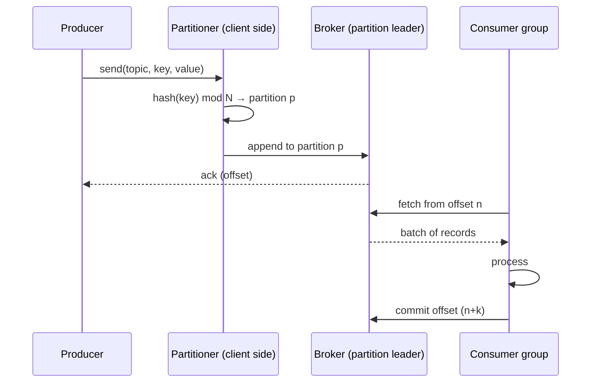

# 03 — Anatomy of a Message & The Message Lifecycle

> Level: Beginner

This chapter zooms under the hood: what a Kafka message *is*, and every step it takes from a producer's mind to a consumer's hands.

---

## 1. Anatomy of a message (record)

Kafka calls them **records**; "message" is the traditional broker term — this guide uses both. A record has four attributes:

| Attribute | Purpose |
|---|---|
| **Key** (optional) | Determines the partition. Also useful for lookups/log compaction |
| **Value** | The payload — bytes; you choose the format (JSON, Avro, Protobuf...) |
| **Timestamp** | Milliseconds; broker or app sets it. Affects ordering on the log |
| **Headers** | Optional key/value pairs (like HTTP headers) for metadata — no role in partitioning |

If no key is set, the producer round-robins (sticky-batches) messages across partitions. If a key is set, the **same key always lands on the same partition** — which is exactly what preserves per-entity ordering.

## 2. The lifecycle, step by step



### Step 1 — Producer creates the record
Via a client library or the CLI:

```bash
# kafka-console-producer: parse "key:value" strings
kafka-console-producer --topic my-topic --bootstrap-server localhost:9092 \
  --property parse.key=true --property key.separator=:
```

Typing `key1:hello kafka` and `key2:hello again` appends two records: keys `key1`, `key2` with their values. Every serious language has a client library (Java, Go via sarama, Node via kafkajs, Python via confluent-kafka...) — see [Part 3](../part-3-go-and-configs/02-producer.md).

### Step 2 — Where does it go? Partition selection
The cluster must decide **topic → partition → broker**:

1. **Is there a key?**
   - **No key** → round-robin/random assignment. Fine for simple cases; no ordering guarantees.
   - **Key present** (the common path) → hash the key (murmur2), then **modulo the number of partitions**:

     ```
     partition = murmur2(key) % num_partitions
     ```

     Deterministic: `ARG-BRA` maps to, say, partition 5 — this event and every future `ARG-BRA` event land on partition 5 in append order.

2. **Which broker owns that partition?** A **controller** in the cluster maintains the partition→broker mapping (a simple lookup table); the producer's client fetches this metadata and writes **directly to the partition's leader broker**.

3. The broker **appends the record to the log file**. All of steps 1–3 are native Kafka machinery — as a developer, your only real decision is **choosing a good key** (chapter 08).

### Step 3 — The log and offsets
Once appended, the record lives at a fixed **offset** in the partition:

```
offset:   0        1        2        3        4
record: [ A      ][ B      ][ C      ][ D      ][ E ... ]
                        append →
```

### Step 4 — Consumption by offset
A consumer **pulls** records by specifying where it stands: "I have consumed through offset 2 — give me everything after." Reading is cheap sequential I/O, and consumers control their own pace.

CLI example:

```bash
kafka-console-consumer --topic my-topic --from-beginning \
  --bootstrap-server localhost:9092 \
  --property print.key=true --property print.offset=true
```

### Step 5 — Offset commits: surviving crashes
What if a consumer restarts and forgets its position?

- Consumers periodically **commit their offsets back to Kafka** (stored in an internal topic, `__consumer_offsets`)
- In a **consumer group**, Kafka tracks the group's committed offset *per partition*, so:
  - any member can ask for the next message after the group's committed position
  - a crashed/restarted member resumes exactly where the group left off

So the loop is: **read → process → track offset locally → commit periodically → resume from commit on failure**.

> The *timing* of commits versus processing defines your delivery guarantees (at-most-once vs at-least-once) — covered in [chapter 09](09-fault-tolerance-and-durability.md) and, with Go code, [Part 3 chapter 04](../part-3-go-and-configs/04-delivery-semantics.md).

---

## Key takeaways

1. A record = **key + value + timestamp + headers**; only the value is mandatory.
2. Partitioning is deterministic math, not magic: `murmur2(key) % num_partitions` — same key, same partition, same order.
3. No key = round-robin = maximum spread, zero per-entity ordering.
4. Offsets are the consumer's cursor; **committed to Kafka**, they make restarts and group membership changes safe.
5. Your main design lever here is the **partition key** — revisit it in [08 — Scalability](08-scalability.md).

**Next:** [04 — Replication: what happens when brokers die](04-replication.md)
