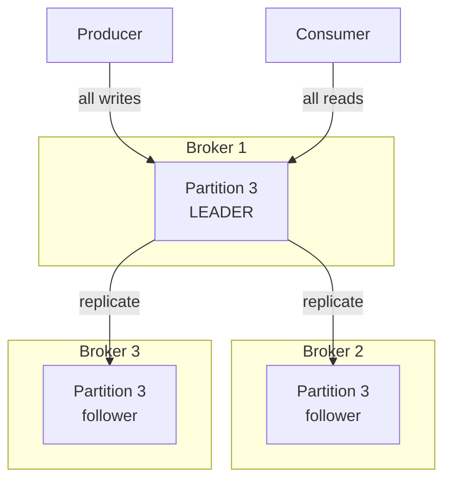

# 04 — Replication: Leaders, Followers, and Durability

> Level: Intermediate

A partition lives on a broker, and brokers are just servers — servers die. Kafka's answer is **replication**: every partition has copies spread across multiple brokers, so the loss of any single broker never loses data.

---

## 1. Leader and followers

Each partition has **one leader replica** and zero or more **follower replicas** (total copies = the topic's **replication factor**, default 3).

**Rules of the model:**

- The **leader handles all reads and writes** for that partition. Clients only ever talk to the leader
- **Followers passively replicate** the leader's log — they do not serve client requests
- The **cluster controller** assigns leaders and keeps leader replicas spread evenly across brokers so no single machine becomes a hotspot
- If the leader's broker dies, the controller promotes an up-to-date follower to leader; clients are redirected transparently

## 2. In-sync replicas (ISR)

A follower is **in-sync** if it has fully caught up with the leader's log (within a configurable lag threshold, `replica.lag.time.max.ms`). The set of in-sync replicas is the **ISR**.

- `replication.factor=3` means three copies exist; `min.insync.replicas=2` requires at least 2 in-sync copies for `acks=all` writes to succeed
- If followers fall behind, they leave the ISR; if the ISR shrinks below `min.insync.replicas`, producers with `acks=all` get errors rather than writing data that is not safely replicated

This is the machinery behind Kafka's durability guarantee: **a message acknowledged with `acks=all` and `min.insync.replicas≥2` survives the simultaneous loss of any single broker** (and is not lost as long as one copy remains).

## 3. The two durability knobs

Both are set at topic (or broker) level; together they define your durability/latency/storage trade-off.

| Setting | What it controls | Trade-off |
|---|---|---|
| **`acks`** (producer-side) | How many replicas must confirm a write before the broker says "done": `0` fire-and-forget, `1` leader-only, `all` full ISR | `all` = maximum durability, more latency; `1`/`0` = faster, weaker guarantees |
| **`replication.factor`** (topic-side) | Number of copies of each partition | More copies = more durable, more storage and network overhead |

Details of how they interact — and what happens when consumers die — are in [chapter 09](09-fault-tolerance-and-durability.md).

---

## Key takeaways

1. Replication is per **partition**, not per broker or topic.
2. One **leader** serves all traffic; **followers** are passive standbys; the **controller** orchestrates.
3. **ISR** = followers caught up enough to be promotable; `min.insync.replicas` + `acks=all` is the durability contract.
4. `replication.factor` = how many copies; `acks` = how strictly a write must be confirmed.

**Next:** [05 — ZooKeeper vs KRaft: who coordinates the cluster itself](05-zookeeper-vs-kraft.md)
