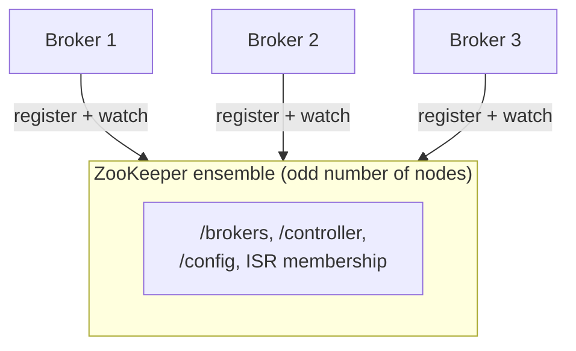
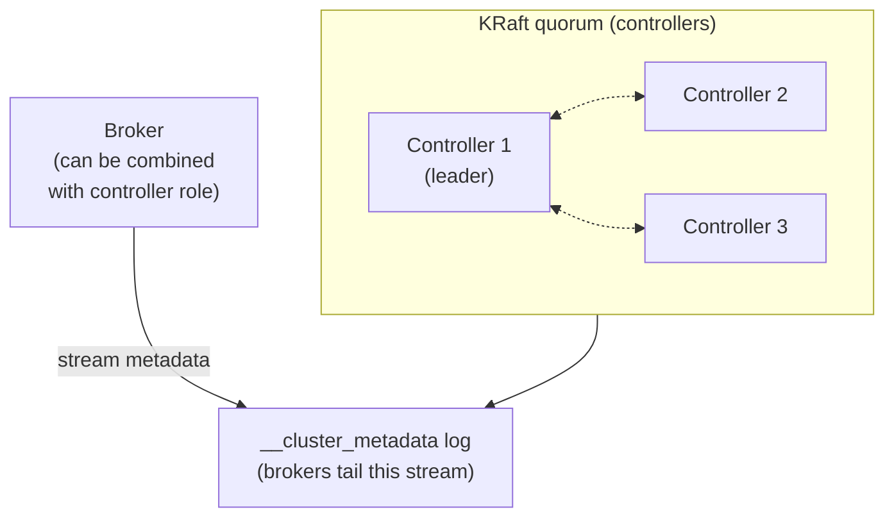

# 05 — Cluster Coordination: ZooKeeper vs KRaft

> Level: Intermediate

Brokers need shared answers to cluster questions: *which brokers are alive? which broker is the controller? which replica leads partition 7? who owns which consumer group's offsets?* Something must coordinate that metadata. Kafka has done this two ways across its history.

---

## 1. The ZooKeeper era (classic mode)

Until Kafka 2.8, a separate system — **Apache ZooKeeper** — held the cluster's brain:

- Brokers registered themselves in ZooKeeper (ephemeral nodes) — death by session timeout, not heartbeat gossip
- **Controller election**: brokers raced to create the `/controller` znode; winner became controller
- Partition/ISR assignments and topic configs also lived in ZooKeeper
- The controller watched everything and pushed changes to brokers

**Costs:** an extra distributed system to operate, scaling bottleneck for large clusters (thousands of partitions), metadata changes funneled through controller→ZooKeeper round-trips, and two consistency models to reason about.

## 2. KRaft mode (the present)

**K Raft** ("Kafka Raft") removes ZooKeeper: the cluster manages its own metadata with **Raft consensus** among designated **controller** nodes. Metadata becomes (fittingly) **an append-only, replicated event log** — the same philosophy Kafka uses for data, applied to itself.

**Key properties:**

- Controllers (an odd-sized voter set, e.g., 3 or 5) elect a leader via Raft and replicate the metadata log
- Brokers (optionally on the same nodes as controllers — `process.roles=broker,controller`) consume the metadata log like any stream, keeping every broker's view consistent
- Scale: KRaft supports **millions of partitions** where ZooKeeper mode strained at tens of thousands
- Operations: one system fewer to deploy, secure, upgrade, and monitor

**Practical notes:**

- ZooKeeper was **removed in Kafka 4.0** — KRaft is not optional anymore for new deployments; migration tooling existed for 2.8–3.x clusters
- In KRaft you configure `process.roles`, `node.id`, `controller.quorum.voters`, and a `CLUSTER_ID` instead of ZooKeeper connection strings
- Client-visible behavior (producer/consumer APIs) did not change — this is infrastructure plumbing

## Comparison at a glance

| | ZooKeeper mode | KRaft mode |
|---|---|---|
| Metadata store | External ZK ensemble | Internal Raft log (`__cluster_metadata`) |
| Controller election | ZK ephemeral create race | Raft election among controllers |
| Partition ceiling | ~tens of thousands | Millions |
| Systems to operate | Kafka + ZooKeeper | Kafka only |
| Status | Removed in Kafka 4.0 | The default (and future) |

---

## Key takeaways

1. Coordination answers: broker liveness, controller identity, leader assignments, configs.
2. ZooKeeper = external brain; KRaft = self-managed Raft metadata log — Kafka applying its own log idea to cluster state.
3. KRaft means: fewer moving parts, faster metadata changes, far higher partition scalability.
4. For app developers the client API is identical; KRaft matters when you operate clusters (see [Part 3 setup](../part-3-go-and-configs/01-setup-and-broker.md) for a KRaft docker-compose).

**Next:** [06 — The Big Picture: every piece assembled](06-the-big-picture.md)
