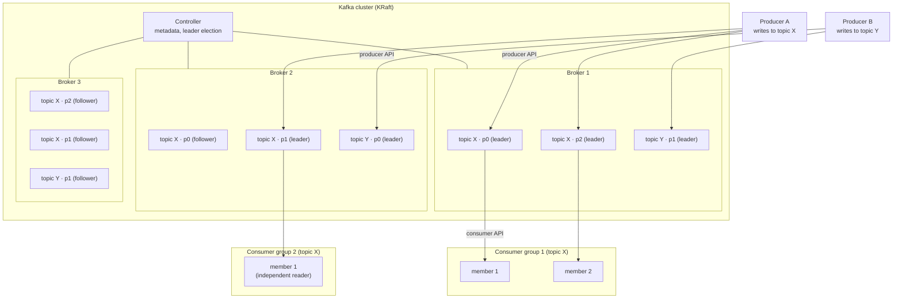

# 06 — The Big Picture: Full Architecture

> Level: Beginner

Everything from chapters 01–05 assembled into one diagram. If you can redraw and narrate this, you understand Kafka's architecture.

## Narrating the diagram

1. **Producers** write records to topics via the **producer API**. Each record's **key** is hashed (`murmur2(key) % partitions`) to pick a partition; metadata tells the producer which broker leads that partition, and the write goes straight to that leader.
2. **Brokers** are the servers. Each **partition** is an append-only log on disk; each partition has a **leader** (serves traffic) and **followers** (replicate). The **controller** keeps assignments balanced and handles leader elections. In KRaft mode, controllers manage metadata via Raft with no ZooKeeper.
3. **Topics** are logical groupings: topic X's partitions are scattered over brokers; a consumer subscribing to topic X reads all its partitions.
4. **Consumers** in the same **group** split the partitions among themselves (one partition → exactly one member); **different groups** each read the whole stream independently.
5. Consumers **pull** batches, process, and periodically **commit offsets** to Kafka (`__consumer_offsets`) — restarts and rebalances resume from those commits.

## One-table recap

| Concept | One-liner |
|---|---|
| Producer | Writes records to a topic, key decides partition |
| Broker | Server storing partition logs |
| Controller | Metadata authority; assigns leaders |
| Topic | Logical stream name |
| Partition | Physical append-only log; unit of ordering & parallelism |
| Offset | Record position; consumer's cursor |
| Consumer group | Exclusive per-partition readers; the work-queue mechanism |
| Replication | Leader + follower copies; durability under broker loss |
| KRaft | Kafka's built-in Raft metadata mode (no ZooKeeper) |

**Next:** [07 — when you should actually reach for Kafka](07-when-to-use-kafka.md)
