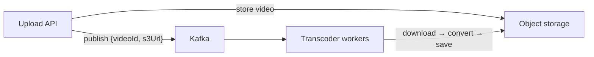
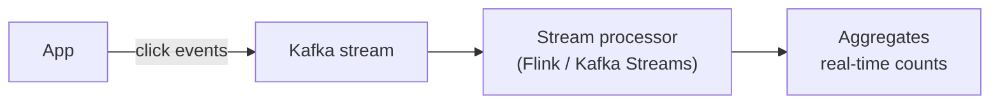

# 07 — When to Use Kafka: Queue & Stream Use Cases

> Level: Beginner

Kafka plays two roles: a **message queue** and an **event stream**. Recognizing which role your system needs is how you justify Kafka in a design — and how you answer "why Kafka?" in an interview.

---

## Role 1: As a message queue

In queue mode, events are processed asynchronously — the consumer chooses when to read, and messages can wait in the topic.

### 1.1 Async processing (the buffer pattern)

When work is slow and the user does not need a synchronous response, put a Kafka buffer in between.

**Example — YouTube-style video transcoding:**

The upload request finishes in seconds; the message carries only a *pointer* (video ID + S3 URL — a few bytes); the transcoders chew through the queue. Kafka absorbs the burst between fast uploads and slow transcoding.

### 1.2 Ordered, metered admission (the waiting-room pattern)

When too many users contend for a scarce resource, use Kafka as a waiting queue and admit users in controlled batches.

**Example — ticket sales for a hot event:** users hitting "view event" land in the topic; a service periodically pulls the next batch of 100 and tells them it is their turn to book. Contention collapses into fair, ordered waves.

### 1.3 Decoupling for independent scaling

When producers and consumers have wildly different load profiles and cost profiles.

**Example — coding-competition grading:** 100k submissions in one hour. The API tier scales wide, dumps submissions into Kafka, stays cheap and fast; the expensive container pool that executes code stays small and drains the queue at a steady rate. Each tier scales to *its* economics, not the other's.

## Role 2: As an event stream

In stream mode, data flows continuously and consumers must keep up to provide (near) real-time behavior.

### 2.1 Real-time aggregation

**Example — ad-click aggregation:** every ad click lands in a `clicks` topic; a stream processor (e.g., Flink) continuously aggregates counts per ad and advertiser, updating dashboards/billing in seconds rather than nightly batches.

### 2.2 Pub/sub fan-out to many live readers

**Example — live-video comments:** a comment is published once; every presence-server that holds a viewer's connection subscribes to the stream and pushes the comment to its own viewer. One event, delivered to a million sockets, without the producer knowing about any of them.

---

## Decision checklist

Reach for Kafka when one or more of these hold:

- [ ] Processing can happen **asynchronously**
- [ ] You must **absorb bursts** between fast producers and slow consumers
- [ ] Producers and consumers must **scale independently**
- [ ] Multiple services need **the same events independently** (fan-out)
- [ ] You need **ordered processing per entity** (partition key)
- [ ] You need **replayable history** (retention + offsets)
- [ ] High sustained **throughput** matters

If your problem is *complex routing of individual tasks* (priorities, delays, TTLs, pattern-matched routing) with no replay needs, a queue-centric broker like RabbitMQ may fit better — see [Part 1 chapter 02](../part-1-foundations/02-rabbitmq-vs-kafka.md).

**Next:** [08 — Deep dive: scalability, partition keys, and hot partitions](08-scalability.md)
