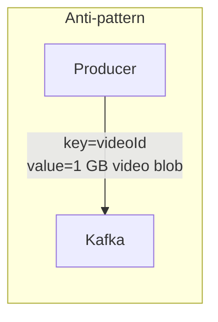
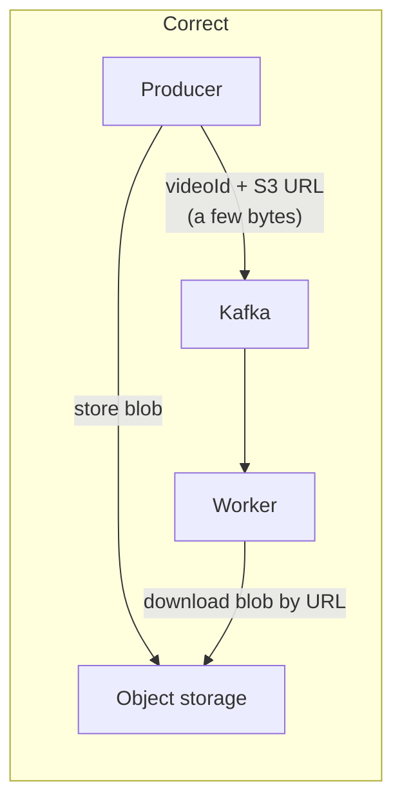

# 08 — Deep Dive: Scalability, Partition Keys, and Hot Partitions

> Level: Intermediate

Scalability is the most common follow-up question about Kafka: *how does it scale, and how do you scale with it?* Three ingredients: capacity baselines, the partition key, and hot-partition handling.

---

## 1. Constraints and baselines

### 1.1 Keep messages small (rule of thumb: < 1 MB)

There is no hard architectural cap on message size (the broker's default limit is ~1 MB and is configurable), but big messages strain the network, the broker's memory, and replication. Practical guidance: **keep messages under 1 MB**.

**The classic anti-pattern — putting the blob on Kafka:**



**The right pattern — the pointer (claim-check):**



Kafka carries the *reference*; object storage carries the bytes. The same discipline applies to large documents, images, and ML features.

### 1.2 Broker capacity (back-of-envelope numbers)

For well-provisioned hardware, rough planning numbers:

- **Storage:** ~1 TB of messages per broker
- **Throughput:** ~10,000 messages/second per broker (highly dependent on message size and hardware)

Hand-wavy, but exactly what you need for capacity math in a design discussion: *estimate your message rate and retention needs, divide, and decide whether one broker suffices.* If it does — say so; a single broker is a legitimate answer for modest scale.

## 2. The two scaling moves

When you outgrow one broker:

**Step 1 — add brokers.** More machines = more aggregate disk, network, and CPU. Mechanical, easy.

**Step 2 — partition well.** The decision that matters: **choose your partition key**. Partitions are the unit of parallelism, and the key decides how records spread across them:

- **Bad key** → a **hot partition**: one partition/broker eats most of the traffic while others idle
- **Good key** → even distribution across the partition space, maximum parallelism

> Managed services (Confluent Cloud, AWS MSK, ...) automate broker elasticity, but **the partition key remains your decision** — the concepts below still apply.

## 3. Hot partitions: diagnosis and fixes

**Scenario:** an ad-click pipeline partitioned by `ad_id`. Nike launches a LeBron James ad — one `ad_id` now carries a monstrous share of all clicks. Its single partition is overwhelmed; the rest of the cluster watches.

Three remedies, in increasing sophistication:

### Fix 1 — Remove the key (when order doesn't matter)

No key → round-robin across all partitions → perfectly even spread. If you have *no* ordering requirement for that stream, this is the simplest complete fix.

### Fix 2 — Compound key (order preserved per sub-key)

Spread one hot key across several partitions by appending a discriminator:

```
key = ad_id + ":" + random(1..10)
```

The Nike ad's events now split across 10 partitions (~10x headroom), each shard still internally ordered.

Variants: append `user_id` or a hash-prefix of it. Consequences to state out loud:

- The producer needs logic to know *which* keys are hot and apply this only to them
- **Ordering is now only per-compound-key** (per shard), not per `ad_id` — downstream aggregation must merge shards (e.g., sum per-shard counts)
- Consumers must understand the sharded-key convention

### Fix 3 — Backpressure (slow the producer)

The producer detects an overwhelmed topic/partition and throttles its own production rate. Works only when the producer *can* slow down (batch pipelines, crawlers); useless for user-facing firehoses.

### Bonus — pick the right key in the first place

The golden rule: **partition by the entity whose state must evolve in order.** High-cardinality, evenly-used entity IDs (user_id, order_id, wallet_id, session_id) almost always distribute well. Low-cardinality or celebrity-prone keys (`ad_id`, `country`, one famous `user_id`) are hot-partition factories.

---

## Key takeaways

1. Messages < 1 MB; put blobs in object storage and the pointer in Kafka.
2. Planning numbers: ~1 TB and ~10k msg/s per broker — do the math, and don't be shy about one broker if the math says so.
3. Scaling = brokers (mechanical) + partition key (the real design decision).
4. Hot partition fixes: drop the key (no ordering), compound/shard the key (order per shard, needs merge), backpressure (when possible).
5. Managed services scale brokers for you; nobody can choose your key for you.

**Next:** [09 — Deep dive: fault tolerance and durability](09-fault-tolerance-and-durability.md)
