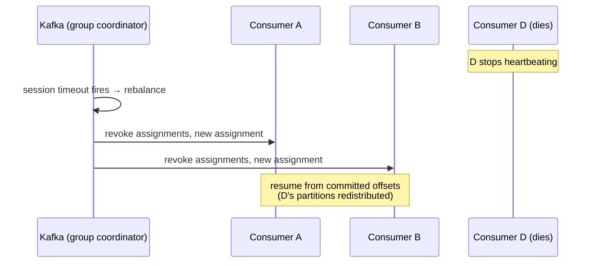

# 09 — Deep Dive: Fault Tolerance & Durability

> Level: Intermediate

Kafka is chosen precisely because its durability and availability guarantees are strong. This chapter covers the knobs (acks, replication factor), what happens when consumers die, and the subtle art of *when to commit an offset*.

---

## 1. The two settings that encode durability

### `replication.factor` (topic-level)

How many copies of each partition exist. Default **3**. More copies = more durability and fault tolerance, at the cost of storage and replication traffic. On a single-broker dev cluster you force it to 1 — but production topics should tolerate at least one broker loss.

### `acks` (producer-level)

How many replicas must acknowledge a write before the producer considers it committed:

| Value | Meaning | Durability | Latency |
|---|---|---|---|
| `0` | Fire and forget — no wait | None; losses possible | Lowest |
| `1` | Leader-only ack | Lost if leader dies before followers replicate | Low |
| `all` | All in-sync replicas ack (`min.insync.replicas` enforced) | Maximum | Highest |

The trade-off is **durability vs performance**: `acks=all` waits for every in-sync follower; `acks=1` proceeds as soon as the leader persists — faster, but a well-timed leader crash can lose the record.

> Pair `acks=all` with `min.insync.replicas=2` on a RF=3 topic: writes then *fail* (producer error) if fewer than 2 replicas are in sync — you choose errors over silent data loss.

## 2. "What if Kafka goes down?"

It is effectively always up. With replication factor ≥ 3 and multiple brokers, the cluster survives broker failures transparently: followers are promoted, traffic is redirected. A common (mild) pushback in design reviews: Kafka going *down* is not a scenario worth designing around — **individual component failures are, and Kafka is built to absorb them**.

The realistic failure questions are about *your* producers, consumers, and their interactions with the cluster:

## 3. What happens when a consumer dies?

Recall the pattern from [chapter 03](03-message-lifecycle.md): read → process → **commit offsets to Kafka** (periodically).

**Single consumer restart:** it comes back, asks Kafka for the group's committed offset, and resumes exactly where it left off. Messages processed after the last commit are **redelivered** (at-least-once) — see §5.

**A member of a consumer group dies:** each member owns specific partitions. Kafka triggers a **rebalance**:

The group coordinator (a broker) detects the dead member via missed heartbeats past `session.timeout.ms`, redistributes its partitions among survivors, and everyone resumes from **committed offsets**. Members joining trigger the same rebalance machinery.

Rebalances have a cost: partitions stop being consumed during them. Steady group membership and session timeouts tuned to your processing latency keep rebalances rare and short.

## 4. Commit timing: the subtle correctness decision

**Committing an offset = claiming the work is done.** Commit too early and you lose work; commit too late and you duplicate work.

**Example — a web crawler:** the consumer pulls a URL, downloads the page, and stores the HTML in S3.

- **Correct:** commit the offset only after S3 confirms the store — the job is provably done
- **Bug:** pull the message → *commit immediately* → then fetch the page. If the consumer crashes mid-fetch, the offset is already committed: on restart the message is never revisited → **the page is silently never crawled**

General rules:

1. Commit **after** the logical unit of work completes (including side effects: DB writes, API calls, file stores)
2. Keep each message's work **small** — a long unit widens the crash-replay window and slows rebalances
3. Pair delayed commits with **idempotent processing** (dedup), because the window between process and commit guarantees redelivery sometimes happens

## 5. The delivery-semantics lens

Commit timing literally selects your semantic:

| Policy | Semantics | Failure result |
|---|---|---|
| Commit before processing | **At-most-once** | Possible lost work |
| Commit after processing (+ dedup downstream) | **At-least-once** | Possible duplicates (absorbed by idempotent handlers) |
| Idempotent producer + transactions | **Exactly-once** (Kafka-to-Kafka) | Neither, within transactional scope |

Full treatment with Go code: [Part 3 chapter 04](../part-3-go-and-configs/04-delivery-semantics.md).

---

## Key takeaways

1. Durability = `replication.factor` (copies) × `acks` (write strictness); RF=3 + `acks=all` + `min.insync.replicas=2` is the production standard.
2. Kafka the cluster is effectively always available — design for *your* consumers and producers failing, not Kafka.
3. Consumers survive crashes via **committed offsets**; groups survive member loss via **rebalances**; both resume from commits.
4. **Commit = done.** Commit only after side effects land, keep units of work small, and make handlers idempotent because redelivery is a fact of life.

**Next:** [10 — Deep dive: errors, retries, and dead-letter queues](10-errors-and-retries.md)
