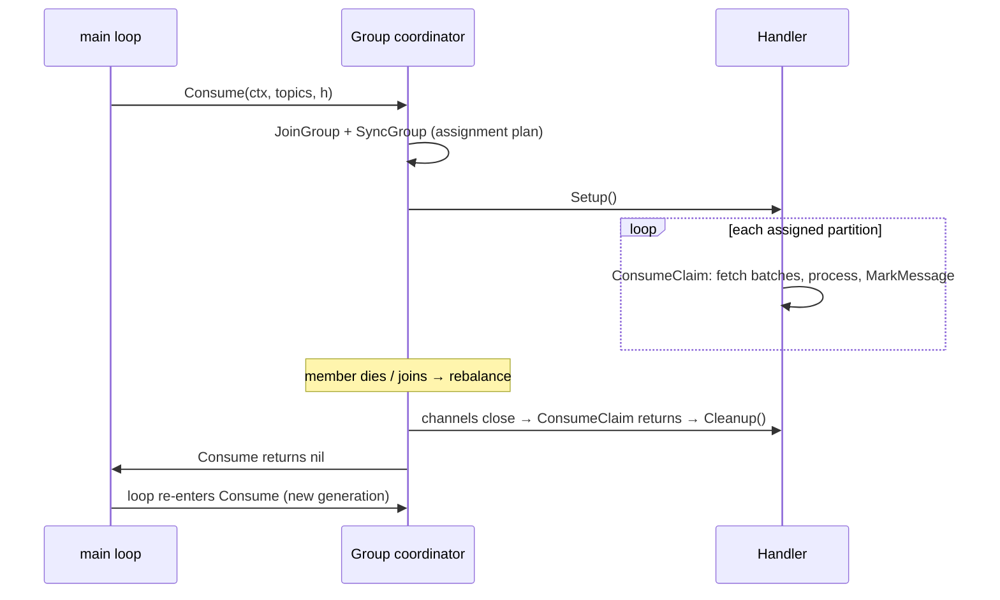

# 03 — Consumer Groups in Go: Code & Configs

> Level: Intermediate

sarama's group consumer has one contract you must implement (`ConsumerGroupHandler`) and one loop you must write. Everything else is config: where to start, when to commit, how fast to detect death.

---

## 1. The complete consumer

```go
package main

import (
	"context"
	"fmt"
	"log"
	"os/signal"
	"syscall"
	"time"

	"github.com/IBM/sarama"
)

type handler struct{}

// Setup runs when this member joins the group and receives its assignment.
func (h *handler) Setup(sarama.ConsumerGroupSession) error { return nil }

// Cleanup runs when the session ends (rebalance or shutdown).
func (h *handler) Cleanup(sarama.ConsumerGroupSession) error { return nil }

// ConsumeClaim is the actual message loop for ONE assigned partition.
func (h *handler) ConsumeClaim(sess sarama.ConsumerGroupSession, claim sarama.ConsumerGroupClaim) error {
	for msg := range claim.Messages() { // channel closes on rebalance/shutdown
		fmt.Printf("topic=%s partition=%d offset=%d key=%s value=%s\n",
			msg.Topic, msg.Partition, msg.Offset, string(msg.Key), string(msg.Value))

		// process the message HERE; only then mark it
		sess.MarkMessage(msg, "")
	}
	return nil // session over; the outer loop re-enters Consume
}

func main() {
	config := sarama.NewConfig()
	config.Version = sarama.V3_5_0_0
	config.Consumer.Offsets.Initial = sarama.OffsetOldest
	config.Consumer.Offsets.AutoCommit.Interval = time.Second

	group, err := sarama.NewConsumerGroup([]string{"localhost:9092"}, "billing-v1", config)
	if err != nil {
		log.Fatal(err)
	}
	defer group.Close()

	ctx, stop := signal.NotifyContext(context.Background(), syscall.SIGINT, syscall.SIGTERM)
	defer stop()

	h := &handler{}
	for {
		// ONE call = ONE session. Returns when: rebalance, error, or ctx done.
		if err := group.Consume(ctx, []string{"orders"}, h); err != nil {
			log.Printf("session ended with error: %v", err)
		}
		if ctx.Err() != nil { // shutdown requested
			return
		}
		// nil error = rebalance happened; immediately re-enter
	}
}
```

## 2. The lifecycle, mapped to the code



**Non-negotiables:**

1. `Consume` **is** the session. Loop around it forever; exit only on `ctx` cancellation or `ErrClosedConsumerGroup`.
2. `MarkMessage` is **not** a network call — it updates an in-memory tracker, flushed as an offset commit every `AutoCommit.Interval`. That flush gap *is* your at-least-once window ([ch. 04](04-delivery-semantics.md)).
3. Never block `ConsumeClaim` forever: a handler stuck for longer than `session.timeout` gets the member evicted mid-processing.

## 3. The configs that matter

| Config | Syntax | Meaning |
|---|---|---|
| `Consumer.Offsets.Initial` | `sarama.OffsetOldest` / `sarama.OffsetNewest` | Fires **only when no committed offset exists** (true first boot). `Oldest` = replay everything (dup-prone, loss-safe); `Newest` = skip backlog (loss-prone) |
| `Consumer.Offsets.AutoCommit.Enable` | `true` (default) | Commit the marks periodically |
| `Consumer.Offsets.AutoCommit.Interval` | `1 * time.Second` | Commit cadence = your at-least-once window width |
| `Consumer.Group.Session.Timeout` | `10 * time.Second` | No heartbeat past this → member declared dead → rebalance |
| `Consumer.Group.Heartbeat.Interval` | `3 * time.Second` | Keep well under session timeout (default ~1/3) |
| `Consumer.Group.Rebalance.GroupStrategies` | `[]sarama.BalanceStrategy{sarama.NewBalanceStrategyRoundRobin()}` | How partitions map to members across the group (range/roundrobin/sticky) |
| `Consumer.MaxProcessingTime` | `1 * time.Second` | Max time per message batch before the partition is considered stalled |
| `Consumer.Fetch.Default` | `1 MiB` | Bytes per fetch request — bigger = fewer round-trips, more latency |

## 4. Manual commits (off autopilot)

Disable autocommit and own the commit decision — the basis for tighter delivery guarantees:

```go
config.Consumer.Offsets.AutoCommit.Enable = false

func (h *handler) ConsumeClaim(sess sarama.ConsumerGroupSession, claim sarama.ConsumerGroupClaim) error {
	for msg := range claim.Messages() {
		if err := process(msg); err != nil {
			log.Printf("processing failed: %v", err)
			// decide: retry, park, or skip — see chapter 04 & Part 2 ch. 10
		}
		sess.Commit() // synchronous commit, exactly when YOU say "done"
	}
	return nil
}
```

`sess.Commit()` is synchronous — durable control, at a throughput cost. Middle grounds exist (commit every N messages), but the principle is fixed: **commit = the work is done, never before.**

## 5. One group or many? (quiz yourself)

- Same `group.id`, 3 replicas of your service → partitions split among them; each message processed once → **work queue**
- A second service, different `group.id` → reads the same topic independently → **pub/sub**
- More members in a group than partitions → extras **idle** (ceiling = partition count)

**Next:** [04 — turning these knobs into delivery semantics](04-delivery-semantics.md)
